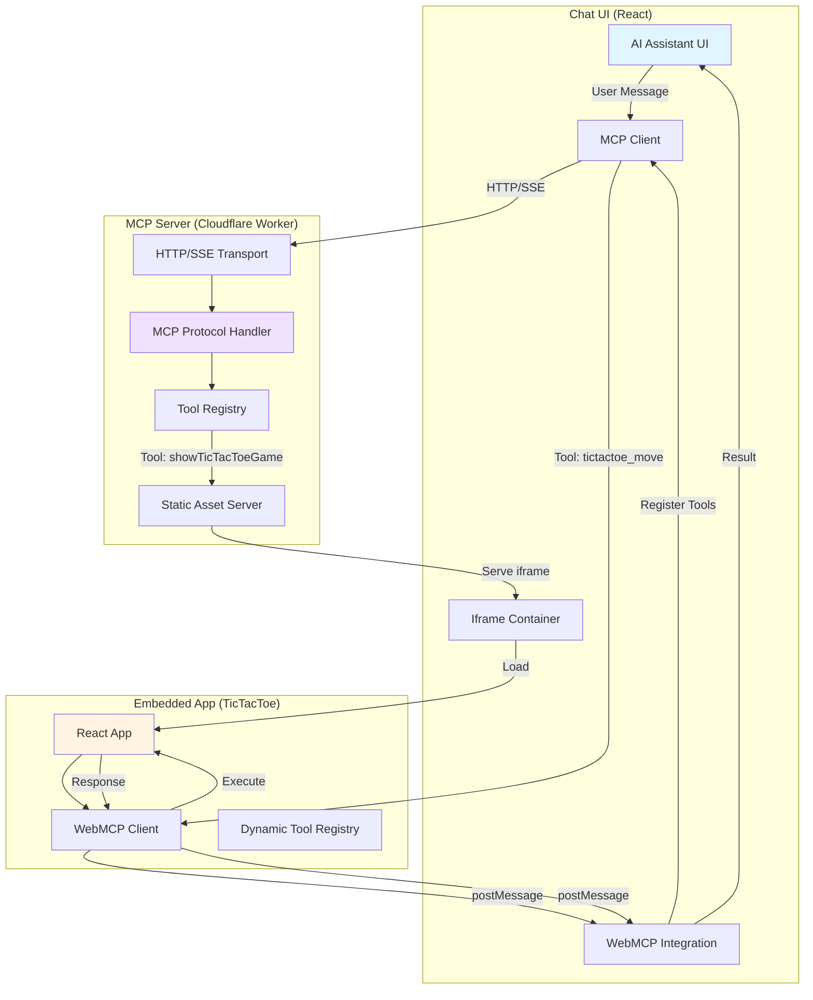

# MCP UI + WebMCP Demo Monorepo

[](https://github.com/WebMCP-org/mcp-ui-webmcp/actions/workflows/ci.yml)
[](https://github.com/WebMCP-org/mcp-ui-webmcp/blob/main/LICENSE)
[](https://nodejs.org)
[](https://pnpm.io)
[](https://www.typescriptlang.org)

A demonstration monorepo showcasing the powerful combination of **MCP UI** (Model Context Protocol with UI resources) and **WebMCP** (bidirectional tool registration between AI and embedded web apps).

🔗 **Repository**: [https://github.com/WebMCP-org/mcp-ui-webmcp](https://github.com/WebMCP-org/mcp-ui-webmcp)

<!--
🎮 **Live Demo**: Coming soon!
- Chat UI: https://your-demo-url.pages.dev
- MCP Server: https://your-worker-url.workers.dev
-->

## What Makes This Special?

This monorepo demonstrates a **dual-direction integration pattern**:

1. **MCP Server → UI**: AI assistants invoke tools that display interactive web applications
2. **UI → MCP Server**: Embedded web apps dynamically register tools back to the AI

This creates a powerful feedback loop where AI can show UIs, and those UIs can extend the AI's capabilities.

### Example: Interactive TicTacToe Game

When the AI calls `showTicTacToeGame`:
- The game UI appears in the assistant's side panel
- The game automatically registers 3 new tools for the AI to use
- The AI can now play the game by calling these dynamically registered tools
- All communication happens seamlessly through iframe postMessage

## Monorepo Structure

Three main packages managed by **Turborepo** + **pnpm**:

```
mcp-ui-webmcp/
├── chat-ui/                    # Modern React chat interface
│   ├── src/                    # Chat UI components
│   ├── .env.development        # Dev environment (committed)
│   └── .env.production         # Prod environment (committed)
│
├── remote-mcp-with-ui-starter/ # MCP server with embedded UIs
│   ├── worker/                 # Cloudflare Worker code
│   ├── src/                    # React apps (TicTacToe, etc.)
│   ├── .dev.vars              # Dev environment (committed)
│   └── .prod.vars             # Prod environment (committed)
│
├── e2e-tests/                  # Playwright E2E tests
│   ├── tests/                  # Test suites
│   └── playwright.config.ts    # Playwright configuration
│
├── turbo.json                  # Turborepo configuration
├── pnpm-workspace.yaml         # Workspace definition
└── CLAUDE.md                   # Development guidance
```

## Quick Start

### Prerequisites

- **Node.js 24.3.0** (specified in `.nvmrc`)
- **pnpm 10.14.0+** (for workspace management)

### Installation

```bash
# Install all dependencies
pnpm install
```

### Development

Run both apps together for the full integration experience:

**Terminal 1 - MCP Server:**
```bash
cd remote-mcp-with-ui-starter
pnpm dev
# → http://localhost:8888
# → MCP endpoint: http://localhost:8888/mcp
```

**Terminal 2 - Chat UI:**
```bash
cd chat-ui
pnpm dev
# → http://localhost:5173
# → Automatically connects to localhost:8888/mcp
```

Or from the root:
```bash
pnpm dev  # Runs both apps in parallel
```

### Building

```bash
# Build all packages
pnpm build

# Build specific packages
pnpm --filter chat-ui build
pnpm --filter remote-mcp-with-ui-starter build
```

## Key Features

### MCP UI Resources

The MCP server can return three types of UI resources:

1. **externalUrl** - Embeds an iframe with a URL (used for mini-apps)
2. **rawHtml** - Renders sanitized HTML directly
3. **remoteDom** - Executes JavaScript to build DOM elements

### WebMCP Dynamic Tool Registration

Mini-apps can register tools back to the AI using the `useWebMCP` hook:

```typescript
import { useWebMCP } from '@mcp-b/react-webmcp';

useWebMCP({
  name: "my_tool",
  description: "What this tool does",
  schema: z.object({ param: z.string() }),
  handler: async (params) => {
    return { content: [{ type: "text", text: "Result" }] };
  }
});
```

The AI assistant can now call `my_tool` as if it were a native MCP tool!

### Architecture Diagram



### Communication Flow

```
┌──────────────────────────────────────────────────────────────┐
│                        AI Assistant                          │
│  Calls: showTicTacToeGame                                   │
│  Receives: tictactoe_* tools dynamically                    │
└────────────────┬─────────────────────────┬───────────────────┘
                 │ HTTP                    │ UI Display
                 ↓                         ↓
       ┌──────────────────────────────────────────────┐
       │   Cloudflare Worker (MCP Server)             │
       │   - Tools: showTicTacToeGame, etc.           │
       │   - Serves: Static apps                      │
       └──────────────┬───────────────────────────────┘
                      │ iframe
                      ↓
              ┌────────────────────────┐
              │  TicTacToe App         │
              │  - Registers tools     │
              │  - Handles tool calls  │
              └────────────────────────┘
```

## Package Details

### chat-ui

Modern React chat interface that:
- Connects to MCP servers via HTTP
- Displays MCP UI resources in side panel
- Supports dynamic tool registration via WebMCP
- Built with Vite, React 19, Tailwind CSS 4

[See chat-ui/README.md for details](./chat-ui/README.md)

### remote-mcp-with-ui-starter

MCP server implementation that:
- Runs on Cloudflare Workers
- Serves mini-apps as static assets
- Implements MCP protocol with UI extensions
- Includes TicTacToe game example

[See remote-mcp-with-ui-starter/README.md for details](./remote-mcp-with-ui-starter/README.md)

### e2e-tests

Playwright-based E2E tests that verify:
- Both apps load correctly
- No console errors
- Integration works end-to-end
- React apps mount successfully

[See e2e-tests/README.md for details](./e2e-tests/README.md)

## Common Commands

```bash
# Development
pnpm dev                    # Run both apps
pnpm --filter chat-ui dev   # Run chat UI only
pnpm --filter remote-mcp-with-ui-starter dev  # Run MCP server only

# Building
pnpm build                  # Build all packages
pnpm typecheck              # Type-check all packages
pnpm lint                   # Lint all packages

# Testing
pnpm test                   # Run all E2E tests
pnpm test:integration       # Integration tests
pnpm test:chat-ui          # Chat UI tests only
pnpm test:remote-mcp       # MCP server tests only
pnpm test:ui               # Playwright UI mode (interactive)
pnpm test:debug            # Debug mode (step through)
```

## Deployment

### Deploying the MCP Server (Cloudflare Workers)

The MCP server can be deployed to Cloudflare Workers:

```bash
cd remote-mcp-with-ui-starter

# Build the project
pnpm build

# Deploy to Cloudflare Workers
pnpm deploy

# Or use wrangler directly
wrangler deploy
```

**Configuration:**
1. Update `.prod.vars` with your production worker URL
2. Configure your Cloudflare account in `wrangler.jsonc`
3. Set up Durable Objects bindings if needed

### Deploying the Chat UI (Cloudflare Pages)

The chat UI can be deployed to Cloudflare Pages or any static hosting:

```bash
cd chat-ui

# Build for production
pnpm build

# The dist/ folder contains the static files
# Deploy to Cloudflare Pages:
wrangler pages deploy dist

# Or deploy to other platforms (Vercel, Netlify, etc.)
```

**Configuration:**
1. Update `.env.production` with your MCP server URL
2. Configure build settings:
   - Build command: `pnpm build`
   - Output directory: `dist`
   - Node version: `24.3.0`

### Environment Variables

**Required for Chat UI:**
- `VITE_MCP_SERVER_URL` - URL of your deployed MCP server

**Required for MCP Server:**
- `WORKER_URL` - Your Cloudflare Worker URL (for serving static assets)

See [docs/ENVIRONMENT_SETUP.md](./docs/ENVIRONMENT_SETUP.md) for detailed configuration.

### Testing Deployed Apps

After deployment:

1. Visit your Chat UI URL
2. The app should automatically connect to your MCP server
3. Try asking the AI to "show me a TicTacToe game"
4. Verify the game loads and the AI can interact with it

## Technology Stack

### Core
- **React 19.1.1** with React Compiler
- **TypeScript 5.8.3** with project references
- **Vite 7.1.12** for building
- **pnpm 10.14.0** for package management
- **Turborepo 2.5.6** for monorepo orchestration

### MCP & AI
- **@modelcontextprotocol/sdk** - MCP protocol
- **@mcp-ui packages** - UI resource support
- **@mcp-b packages** - WebMCP integration
- **agents 0.2.20** - McpAgent from Cloudflare
- **Vercel AI SDK** with Anthropic provider

### Deployment
- **Cloudflare Workers** - Serverless deployment
- **Cloudflare Durable Objects** - Stateful MCP instances
- **Hono** - API routing
- **Wrangler** - Cloudflare CLI

### Testing
- **Playwright 1.49.2** - E2E testing

## CI/CD

Two GitHub Actions workflows:

### ci.yml
Runs on PRs and pushes to main:
- Lint all packages
- Type-check all packages
- Build all packages

### e2e.yml
Runs E2E tests:
- Builds packages
- Installs Playwright browsers
- Runs integration tests
- Uploads test reports

## Documentation

### For AI Agents
- **[AGENTS.md](./AGENTS.md)** - Navigation hub for AI assistants working on this codebase
- **[CONTRIBUTING.md](./CONTRIBUTING.md)** - Development standards and best practices for AI agents

### Package Documentation
- **[chat-ui/README.md](./chat-ui/README.md)** - Chat UI documentation
- **[remote-mcp-with-ui-starter/README.md](./remote-mcp-with-ui-starter/README.md)** - MCP server documentation
- **[e2e-tests/README.md](./e2e-tests/README.md)** - Testing documentation

### Architecture & Configuration
- **[remote-mcp-with-ui-starter/ARCHITECTURE.md](./remote-mcp-with-ui-starter/ARCHITECTURE.md)** - Architecture details
- **[docs/ENVIRONMENT_SETUP.md](./docs/ENVIRONMENT_SETUP.md)** - Environment configuration
- **[docs/TESTING.md](./docs/TESTING.md)** - Testing infrastructure

## Troubleshooting

### Port Conflicts
```bash
lsof -ti:5173 | xargs kill  # Kill chat-ui port
lsof -ti:8888 | xargs kill  # Kill MCP server port
```

### TypeScript Errors
```bash
pnpm exec tsc -b  # Check all TypeScript projects
```

### Build Failures
```bash
rm -rf dist/ node_modules/.vite/
pnpm install
pnpm build
```

### Embedded Apps Not Loading
1. Check: `ls -la remote-mcp-with-ui-starter/dist/client/`
2. Verify vite.config.ts entry points
3. Check browser console for errors

### WebMCP Tools Not Registering
1. Verify `initializeWebModelContext()` is called before React renders
2. Check `postMessageTarget: window.parent` is set
3. Inspect browser console for WebMCP errors

## Contributing

This is a demonstration project showing MCP UI + WebMCP integration patterns. Feel free to:

- Fork and experiment
- Report issues
- Submit improvements
- Ask questions

## Resources

- **[Model Context Protocol](https://modelcontextprotocol.io/)**
- **[MCP Specification](https://spec.modelcontextprotocol.io/)**
- **[Cloudflare Workers](https://developers.cloudflare.com/workers/)**
- **[Playwright Documentation](https://playwright.dev/)**

## License

MIT - See LICENSE file for details.

---

**Ready to explore MCP UI + WebMCP?** Start by running `pnpm dev` and opening http://localhost:5173 in your browser! 🚀
