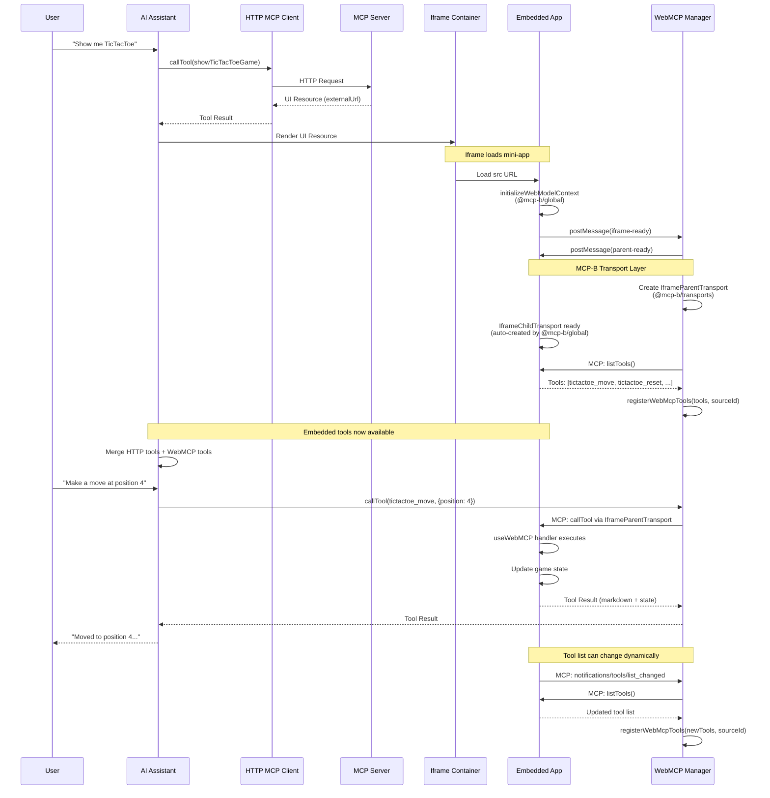

<div align="center">


# MCP UI + WebMCP

**Bidirectional integration between AI assistants and embedded web applications**

[](https://github.com/WebMCP-org/mcp-ui-webmcp/actions/workflows/ci.yml)
[](./LICENSE)
[](https://nodejs.org)
[](https://www.typescriptlang.org)

[Quick Start](#quick-start) • [Architecture](#architecture) • [Packages](#packages) • [Docs](#documentation)

</div>

---

## Try It Live

**Live Chat UI:** [mcp-ui.mcp-b.ai](https://mcp-ui.mcp-b.ai)
**Full App Demo:** [beattheclankers.com](https://beattheclankers.com/)

Visit [beattheclankers.com](https://beattheclankers.com/) to see the full application with embedded iframe. Test the tools yourself using the [MCP-B Chrome Extension](https://chromewebstore.google.com/detail/mcp-b/fkhbffeojcfadbkpldmbjlbfocgknjlj).

---

## What This Does

AI assistants invoke tools that render interactive web apps. Those apps can register new tools back to the AI. This combines [MCP UI resources](https://mcpui.dev/guide/introduction) with [WebMCP bidirectional tool registration](https://github.com/webmachinelearning/webmcp/blob/main/docs/explainer.md).

**Flow:**
1. AI calls `showTicTacToeGame`
2. MCP server returns UI resource with iframe
3. Game loads and registers `tictactoe_move`, `tictactoe_reset`, etc.
4. AI can now play the game using dynamically registered tools

This pattern works for any embedded application: forms, visualizations, interactive demos, configuration UIs.

## Quick Start

```bash
# Install dependencies
pnpm install

# Run both apps (MCP server + Chat UI)
pnpm dev
```

Open http://localhost:5173 and ask the AI to show you a TicTacToe game.

### Requirements

- Node.js 24.3.0+ (see `.nvmrc`)
- pnpm 10.14.0+

## Architecture

### WebMCP vs MCP-B

**WebMCP** is the W3C standard specification for bidirectional tool registration in browsers, defining the `navigator.modelContext` API. **MCP-B** is the reference implementation and polyfill that makes WebMCP available today.

- **WebMCP**: Standards-based API specification (W3C Web Machine Learning Community Group)
- **MCP-B**: Reference implementation providing:
  - Polyfill for `navigator.modelContext` before browser support
  - NPM packages ([`@mcp-b/react-webmcp`](https://www.npmjs.com/package/@mcp-b/react-webmcp), [`@mcp-b/transports`](https://www.npmjs.com/package/@mcp-b/transports), etc.)
  - Translation bridge between WebMCP and MCP protocols
  - Browser extension for testing

### System Architecture

```mermaid
flowchart TB
    subgraph ChatUI["Chat UI Browser Context"]
        UI[AI Chat Interface]
        HTTP_CLIENT[HTTP MCP Client<br/>@modelcontextprotocol/sdk]
        WEBMCP_MGR[WebMCP Integration<br/>useWebMCPIntegration]
        IFRAME[Iframe Container<br/>Side Panel]

        UI --> HTTP_CLIENT
        UI --> WEBMCP_MGR
        WEBMCP_MGR --> IFRAME
    end

    subgraph MCPServer["MCP Server - Cloudflare Worker"]
        TOOLS[Tool Registry<br/>showTicTacToeGame, etc.]
        ASSETS[Static Asset Server<br/>Serves mini-apps]

        TOOLS -.->|Returns UI Resource| ASSETS
    end

    subgraph EmbeddedApp["Embedded App Iframe Context"]
        APP[Mini-App React<br/>TicTacToe, etc.]
        WEBMCP_INIT[MCP-B Polyfill<br/>@mcp-b/global]
        HOOKS[useWebMCP Hooks<br/>@mcp-b/react-webmcp]
        TRANSPORT_CHILD[IframeChildTransport<br/>@mcp-b/transports]

        APP --> HOOKS
        HOOKS --> WEBMCP_INIT
        WEBMCP_INIT --> TRANSPORT_CHILD
    end

    HTTP_CLIENT <-->|HTTP/SSE MCP Protocol| TOOLS
    ASSETS -->|iframe src| APP
    WEBMCP_MGR <-->|IframeParentTransport postMessage| TRANSPORT_CHILD

    style WEBMCP_INIT fill:#e1f5ff
    style HOOKS fill:#e1f5ff
    style TRANSPORT_CHILD fill:#e1f5ff
    style WEBMCP_MGR fill:#e1f5ff
```

### Complete Flow: Tool Call to Bidirectional Communication



### Key Components

#### Chat UI (Parent Context)
- **HTTP MCP Client** (`@modelcontextprotocol/sdk`): Connects to remote MCP server via HTTP/SSE for initial tools
- **WebMCP Integration** ([useWebMCPIntegration.ts](chat-ui/src/hooks/useWebMCPIntegration.ts)): Manages WebMCP clients and tools from iframes
- **Iframe Lifecycle** ([useIframeLifecycle.ts](chat-ui/src/hooks/useIframeLifecycle.ts)): Sets up MCP-B transport for each iframe
- **Tool Routing**: Routes calls to HTTP MCP or WebMCP clients based on source ID
- **IframeParentTransport** (`@mcp-b/transports`): Bidirectional communication channel to embedded apps

#### Embedded Apps (Iframe Context)
- **MCP-B Polyfill** (`@mcp-b/global`): Implements `navigator.modelContext` API
- **useWebMCP Hook** (`@mcp-b/react-webmcp`): Registers tools with automatic lifecycle management
- **IframeChildTransport** (`@mcp-b/transports`): Receives tool calls from parent via postMessage
- **Parent Communication** ([useParentCommunication.ts](remote-mcp-with-ui-starter/src/hooks/useParentCommunication.ts)): Readiness protocol and notifications

#### MCP Server
- **Tool Registry**: Exposes tools like `showTicTacToeGame` that return UI resources
- **UI Resource Types**: Supports `externalUrl`, `rawHtml`, and `remoteDom`
- **Static Assets**: Serves bundled mini-apps for iframe embedding

### MCP UI Resources

Three resource types supported ([learn more](https://mcpui.dev/guide/protocol-details)):

| Type | Use Case | Implementation |
|------|----------|----------------|
| `externalUrl` | Embedded mini-apps | iframe with URL |
| `rawHtml` | Simple markup | Sanitized HTML |
| `remoteDom` | Dynamic content | JavaScript-generated DOM |

[→ MCP-UI Server SDK](https://mcpui.dev/guide/server/typescript/overview) | [→ MCP-UI Client SDK](https://mcpui.dev/guide/client/overview)

### WebMCP Tool Registration

Mini-apps register tools using the `useWebMCP` hook from [`@mcp-b/react-webmcp`](https://www.npmjs.com/package/@mcp-b/react-webmcp) ([docs](https://docs.mcp-b.ai/packages/react-webmcp)):

```typescript
import { useWebMCP } from '@mcp-b/react-webmcp';

useWebMCP({
  name: "tictactoe_move",
  description: "Make a move at position",
  schema: z.object({
    position: z.number().min(0).max(8)
  }),
  handler: async ({ position }) => {
    // Execute move
    return {
      content: [{
        type: "text",
        text: `Moved to position ${position}`
      }]
    };
  }
});
```

The AI can immediately invoke `tictactoe_move` as if it were a native MCP tool.

**MCP-B Packages:**
- [`@mcp-b/react-webmcp`](https://www.npmjs.com/package/@mcp-b/react-webmcp) - React hooks for WebMCP ([docs](https://docs.mcp-b.ai/packages/react-webmcp))
- [`@mcp-b/transports`](https://www.npmjs.com/package/@mcp-b/transports) - Transport layer implementations ([docs](https://docs.mcp-b.ai/packages/transports))
- [`@mcp-b/core`](https://www.npmjs.com/package/@mcp-b/core) - Core WebMCP functionality ([docs](https://docs.mcp-b.ai/packages/core))

[→ MCP-B Quick Start](https://docs.mcp-b.ai/quickstart) | [→ MCP-B Examples](https://docs.mcp-b.ai/examples) | [→ All NPM Packages](https://github.com/WebMCP-org/npm-packages)

## Packages

### chat-ui
React chat interface with MCP client and WebMCP integration. Connects to MCP servers via HTTP, displays UI resources, handles dynamic tool registration.

**Tech:** React 19, Vite, Tailwind CSS 4, Vercel AI SDK

[→ Documentation](./chat-ui/README.md)

### remote-mcp-with-ui-starter
MCP server implementation on Cloudflare Workers. Serves static mini-apps, implements MCP protocol with UI extensions.

**Tech:** Cloudflare Workers, Hono, @modelcontextprotocol/sdk

[→ Documentation](./remote-mcp-with-ui-starter/README.md)

### e2e-tests
Playwright test suite verifying integration between chat UI and MCP server.

[→ Documentation](./e2e-tests/README.md)

## Commands

```bash
# Development
pnpm dev                    # Run all apps
pnpm --filter chat-ui dev   # Chat UI only
pnpm --filter remote-mcp-with-ui-starter dev  # MCP server only

# Build & Quality
pnpm build                  # Build all packages
pnpm typecheck              # Type-check
pnpm lint                   # Lint all packages
pnpm check                  # Run lint + typecheck

# Testing
pnpm test                   # Run E2E tests
pnpm test:ui                # Interactive Playwright UI
pnpm test:debug             # Debug mode
```

## Deployment

### MCP Server → Cloudflare Workers

```bash
cd remote-mcp-with-ui-starter
pnpm build
pnpm deploy  # or: wrangler deploy
```

Configure `.prod.vars` with your worker URL.

### Chat UI → Cloudflare Pages

```bash
cd chat-ui
pnpm build
wrangler pages deploy dist
```

Configure `.env.production` with your MCP server URL.

See [ENVIRONMENT_SETUP.md](./docs/ENVIRONMENT_SETUP.md) for detailed configuration.

## Documentation

### Getting Started
- [AGENTS.md](./AGENTS.md) - Navigation hub for AI agents
- [CONTRIBUTING.md](./CONTRIBUTING.md) - Development standards

### Architecture
- [ARCHITECTURE.md](./remote-mcp-with-ui-starter/ARCHITECTURE.md) - Design decisions
- [EMBEDDING_PROTOCOL.md](./remote-mcp-with-ui-starter/EMBEDDING_PROTOCOL.md) - WebMCP protocol
- [ADDING_NEW_APPS.md](./remote-mcp-with-ui-starter/ADDING_NEW_APPS.md) - Create mini-apps

### Configuration
- [ENVIRONMENT_SETUP.md](./docs/ENVIRONMENT_SETUP.md) - Environment variables
- [TESTING.md](./docs/TESTING.md) - Test infrastructure

## Tech Stack

- **Monorepo:** Turborepo + pnpm workspaces
- **Frontend:** React 19, TypeScript 5.8, Vite 7
- **MCP:** @modelcontextprotocol/sdk, @mcp-ui packages
- **WebMCP:** @mcp-b packages for bidirectional tool registration
- **AI:** Vercel AI SDK with Anthropic provider
- **Runtime:** Cloudflare Workers + Durable Objects
- **Testing:** Playwright 1.49

## Contributing

Fork, experiment, report issues, submit improvements.

See [CONTRIBUTING.md](./CONTRIBUTING.md) for development standards.

## Resources

### MCP-UI (UI Resources)
- [MCP-UI Introduction](https://mcpui.dev/guide/introduction) - Overview of MCP UI resources
- [Protocol Details](https://mcpui.dev/guide/protocol-details) - Resource types and implementation
- [Server SDK (TypeScript)](https://mcpui.dev/guide/server/typescript/overview) - Build MCP servers with UI support
- [Client SDK](https://mcpui.dev/guide/client/overview) - Render UI resources in your client
- [GitHub](https://github.com/idosal/mcp-ui) - Source code and examples

### MCP-B (WebMCP / Bidirectional Tools)

**Documentation:**
- [MCP-B Documentation](https://docs.mcp-b.ai/introduction) - Getting started with WebMCP
- [Quick Start](https://docs.mcp-b.ai/quickstart) - Get WebMCP running in minutes
- [Core Concepts](https://docs.mcp-b.ai/concepts) - Architecture and system design
- [Examples](https://docs.mcp-b.ai/examples) - Ready-to-use implementations

**NPM Packages:**
- [`@mcp-b/react-webmcp`](https://www.npmjs.com/package/@mcp-b/react-webmcp) - React hooks for WebMCP ([docs](https://docs.mcp-b.ai/packages/react-webmcp))
- [`@mcp-b/transports`](https://www.npmjs.com/package/@mcp-b/transports) - Transport layer implementations ([docs](https://docs.mcp-b.ai/packages/transports))
- [`@mcp-b/core`](https://www.npmjs.com/package/@mcp-b/core) - Core WebMCP functionality ([docs](https://docs.mcp-b.ai/packages/core))
- [`@mcp-b/server`](https://www.npmjs.com/package/@mcp-b/server) - Server-side WebMCP support ([docs](https://docs.mcp-b.ai/packages/server))
- [All Packages](https://github.com/WebMCP-org/npm-packages) - Complete package repository

**Live Demos & Tools:**
- [beattheclankers.com](https://beattheclankers.com/) - Full application with embedded iframe
- [mcp-ui.mcp-b.ai](https://mcp-ui.mcp-b.ai) - Live chat UI demo
- [mcp-b.ai](https://mcp-b.ai) - Interactive examples
- [MCP-B Chrome Extension](https://chromewebstore.google.com/detail/mcp-b/fkhbffeojcfadbkpldmbjlbfocgknjlj) - Test tools in your browser

**Specification:**
- [WebMCP Specification](https://github.com/webmachinelearning/webmcp) - W3C Web Machine Learning Community Group
- [WebMCP Explainer](https://github.com/webmachinelearning/webmcp/blob/main/docs/explainer.md) - Technical proposal and API details

### Model Context Protocol
- [MCP Documentation](https://modelcontextprotocol.io/) - Official protocol documentation
- [MCP Specification](https://spec.modelcontextprotocol.io/) - Technical specification
- [MCP GitHub](https://github.com/modelcontextprotocol/modelcontextprotocol) - Specification repository

### Deployment & Infrastructure
- [Cloudflare Workers](https://developers.cloudflare.com/workers/) - Serverless runtime
- [Cloudflare Durable Objects](https://developers.cloudflare.com/durable-objects/) - Stateful coordination
- [Playwright](https://playwright.dev/) - E2E testing framework

## License

This project uses multiple licenses:

- **Chat UI** ([chat-ui/](chat-ui/)): AGPL-3.0 - See [chat-ui/LICENSE](chat-ui/LICENSE)
- **All other packages**: Apache-2.0 - See [LICENSE](LICENSE)

Copyright 2025 Alex Nahas (founder of MCP-B)
