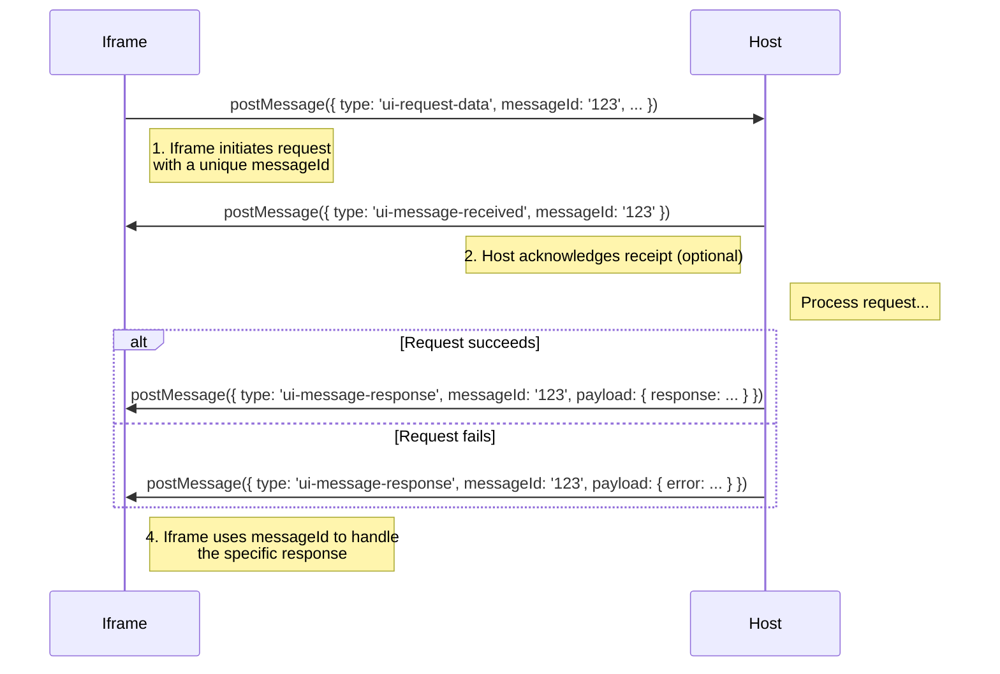

# Embeddable UI Communication Protocol

This document describes the general communication protocol for any embeddable UIs. This is implemented by the mcp-ui iframe based solution, in the context of UI over MCP.

## Concepts

- Embedded iframes communicate with the parent window via `postMessage`
- The parent window can send messages to the iframe
- The iframe can send messages to the parent window

## Communication Protocol

### Message Structure

```typescript
type Message = {
  type: string;
  messageId?: string; // optional, used for tracking the message
  payload: Record<string, unknown>;
};
```

## Message Types

### `intent`
Indicates that the user has interacted with the UI and expressed an intent, and the host should act on it.

**Payload:**
- `intent`: the intent that the user expressed
- `params`: the parameters to pass to the intent

**Example:**
```javascript
window.parent.postMessage(
  {
    type: "intent",
    payload: {
      intent: "create-task",
      params: {
        title: "Buy groceries",
        description: "Buy groceries for the week",
      },
    },
  },
  "*"
);
```

### `notify`
Indicates that the iframe already acted upon the user interaction, and is notifying the host to trigger any side effects.

**Payload:**
- `message`: the message to notify the host with

**Example:**
```javascript
window.parent.postMessage(
  {
    type: "notify",
    payload: {
      message: "cart-updated",
    },
  },
  "*"
);
```

### `prompt`
Indicates that the iframe asks the host to run a prompt.

**Payload:**
- `prompt`: the prompt to run

**Example:**
```javascript
window.parent.postMessage(
  {
    type: "prompt",
    payload: {
      prompt: "What is the weather in Tokyo?",
    },
  },
  "*"
);
```

### `tool`
Indicates that the iframe asks the host to run a tool call.

**Payload:**
- `toolName`: the name of the tool to run
- `params`: the parameters to pass to the tool

**Example:**
```javascript
window.parent.postMessage(
  {
    type: "tool",
    payload: {
      toolName: "get-weather",
      params: {
        city: "Tokyo",
      },
    },
  },
  "*"
);
```

### `link`
Indicates that the iframe asks the host to navigate to a link.

**Payload:**
- `url`: the URL to navigate to

**Example:**
```javascript
window.parent.postMessage(
  {
    type: "link",
    payload: {
      url: "https://www.google.com",
    },
  },
  "*"
);
```

## Reserved Message Types (iframe to host)

### `ui-lifecycle-iframe-ready`
Indicates that the iframe is ready to receive messages.

**Example:** See [Render Data](#passing-render-data-to-the-iframe)

### `ui-size-change`
Indicates that the iframe's size has changed and the host should adjust the iframe's size.

**Payload:**
- `width`: the new width of the iframe
- `height`: the new height of the iframe

**Example:**
```javascript
const resizeObserver = new ResizeObserver((entries) => {
  entries.forEach((entry) => {
    window.parent.postMessage(
      {
        type: "ui-size-change",
        payload: {
          height: entry.contentRect.height,
        },
      },
      "*"
    );
  });
});

resizeObserver.observe(document.documentElement);
```

### `ui-request-data`
A message that the iframe sends to the host to request data. The message must include a `messageId` to allow the iframe to track the response.

**Payload:**
- `requestType`: the type of the request
- `params`: the parameters to pass to the request

**Example:**
```javascript
window.parent.postMessage(
  {
    type: "ui-request-data",
    messageId: "123",
    payload: {
      requestType: "get-payment-methods",
      params: {
        // any params needed for the request
      },
    },
  },
  "*"
);
```

See also [Asynchronous Data Requests with Message IDs](#asynchronous-data-requests-with-message-ids)

### `ui-request-render-data`
A message that the iframe sends to the host to request render data. The message can optionally include a `messageId` to allow the iframe to track the response.

- This message has no payload
- The host responds with a `ui-lifecycle-iframe-render-data` message containing the render data

**Example:**
```javascript
window.parent.postMessage(
  {
    type: "ui-request-render-data",
    messageId: "render-data-123", // optional
  },
  "*"
);
```

## Reserved Message Types (host to iframe)

### `ui-lifecycle-iframe-render-data`
A message that the host sends to the iframe to pass any relevant render data.

**Payload:**
- `renderData`: the render data to pass to the iframe

**Example:** See [Render Data](#passing-render-data-to-the-iframe)

### `ui-message-received`
A message that the host sends to the iframe to indicate that the action has been received. The original `messageId` is passed back to the host to allow the host to track the action. This is useful for `request-data` messages, but is not limited to this type.

**Example:** See [Asynchronous Data Requests with Message IDs](#asynchronous-data-requests-with-message-ids)

### `ui-message-response`
A message that the iframe sends to the host to indicate that the action has been processed. The original `messageId` is passed back to the host to allow the host to track the action. This is useful for `request-data` messages, but is not limited to this type.

**Payload:**
- `response`: the response to the action
- `error`: the error, if any, that occurred

**Example:** See [Asynchronous Data Requests with Message IDs](#asynchronous-data-requests-with-message-ids)

## Query Parameters

### `waitForRenderData`
A query parameter that can be passed to the iframe to indicate that the iframe should wait for the render data to be passed before sending any messages.

- The value of the query parameter is a boolean
- If the query parameter is present, the iframe will wait for the render data to be passed before sending any messages

**Example:** See [Render Data](#passing-render-data-to-the-iframe)

## Usage Examples

### Passing Render Data to the Iframe

**In the host:**

```javascript
iframeSrc = "https://my-embeddable-ui.com?waitForRenderData=true";
iframe = document.createElement("iframe");
iframe.src = iframeSrc; // the iframe will wait for the render data to be passed before rendering
document.body.appendChild(iframe);

window.addEventListener("message", (event) => {
  if (event.data.type === "ui-lifecycle-iframe-ready") {
    iframe.contentWindow.postMessage(
      {
        type: "ui-lifecycle-iframe-render-data",
        payload: { renderData: { theme: "dark" } },
      },
      "*"
    );
  }
});
```

**In the iframe:**

```javascript
// In the iframe's script
const urlParams = new URLSearchParams(window.location.search);
if (urlParams.get("waitForRenderData") === "true") {
  let customRenderData = null;

  // The parent will send this message on load or when we notify it we're ready
  window.addEventListener("message", (event) => {
    // Add origin checks for security
    if (event.data.type === "ui-lifecycle-iframe-render-data") {
      // If the iframe has already received data, we don't need to do anything
      if (customRenderData) {
        return;
      } else {
        customRenderData = event.data.payload.renderData;
        // Now you can render the UI with the received data
        renderUI(customRenderData);
      }
    }
  });
  // We can let the parent know we're ready to receive data
  window.parent.postMessage({ type: "ui-lifecycle-iframe-ready" }, "*");
} else {
  // If the iframe doesn't need to wait for data, we can render the default UI immediately
  renderUI();
}
```

### Alternative: Requesting Render Data On-Demand

Instead of relying on the `ui-lifecycle-iframe-ready` lifecycle event, you can explicitly request render data when needed using `ui-request-render-data`:

**In the iframe:**

```javascript
// Request render data when ready
async function requestRenderData() {
  return new Promise((resolve, reject) => {
    const messageId = crypto.randomUUID();

    window.parent.postMessage(
      { type: "ui-request-render-data", messageId },
      "*"
    );

    function handleMessage(event) {
      if (event.data?.type !== "ui-lifecycle-iframe-render-data") return;
      if (event.data.messageId !== messageId) return;

      window.removeEventListener("message", handleMessage);

      const { renderData, error } = event.data.payload;
      if (error) return reject(error);
      return resolve(renderData);
    }

    window.addEventListener("message", handleMessage);
  });
}

// Use it when your iframe is ready
const renderData = await requestRenderData();
renderUI(renderData);
```

### Asynchronous Data Requests with Message IDs

Actions initiated from the iframe are handled by the host asynchronously (e.g., data requests, tool calls, etc.). It's useful for the iframe to get feedback on the status of the request and its result. This is achieved using a `messageId` to track the request through its lifecycle. Example use cases include fetching additional information, displaying a progress bar in the iframe, signaling success or failure, and more.

The primary message types are:

- **`ui-request-data`**: Sent from the iframe to the host to request some data or action.
- **`ui-message-received`**: Sent from the host to the iframe to acknowledge that the request is being processed.
- **`ui-message-response`**: Sent from the host to the iframe with the final result (success or error).

While this example uses `ui-request-data`, any message from the iframe can include a `messageId` to leverage this asynchronous flow (e.g., `tool`, `intent`).

**Flow:**



**Implementation Example:**

```typescript
// In the iframe - requesting data with tracking
async function requestPaymentMethods() {
  const messageId = crypto.randomUUID();

  return new Promise((resolve, reject) => {
    // Set up listener for response
    function handleResponse(event: MessageEvent) {
      if (event.data.messageId !== messageId) return;

      if (event.data.type === 'ui-message-received') {
        console.log('Request acknowledged, processing...');
      }

      if (event.data.type === 'ui-message-response') {
        window.removeEventListener('message', handleResponse);

        if (event.data.payload.error) {
          reject(event.data.payload.error);
        } else {
          resolve(event.data.payload.response);
        }
      }
    }

    window.addEventListener('message', handleResponse);

    // Send request
    window.parent.postMessage({
      type: 'ui-request-data',
      messageId,
      payload: {
        requestType: 'get-payment-methods',
        params: {},
      },
    }, '*');
  });
}

// Usage
try {
  const paymentMethods = await requestPaymentMethods();
  console.log('Payment methods:', paymentMethods);
} catch (error) {
  console.error('Failed to get payment methods:', error);
}
```

## Security Considerations

**⚠️ IMPORTANT**: For comprehensive security guidance, see [SECURITY.md](../../SECURITY.md) in the repository root. This section provides a quick reference for common security patterns.

### Origin Validation

Always validate the origin of incoming messages in production:

```javascript
const ALLOWED_ORIGINS = [
  'https://parent.example.com',
  'http://localhost:5173', // Development only
];

window.addEventListener("message", (event) => {
  // Validate origin against allowlist
  if (!ALLOWED_ORIGINS.includes(event.origin)) {
    console.warn('Rejected message from unauthorized origin:', event.origin);
    return; // Ignore messages from unknown origins
  }

  // Validate message structure
  if (!isValidMessage(event.data)) {
    console.warn('Invalid message structure:', event.data);
    return;
  }

  // Process message
  handleMessage(event.data);
});
```

### Target Origin

When sending messages, **ALWAYS** specify the target origin instead of using `*`:

```javascript
// ❌ NEVER DO THIS (security vulnerability)
window.parent.postMessage(message, '*');

// ✅ ALWAYS specify the exact origin
const PARENT_ORIGIN = 'https://parent.example.com';
window.parent.postMessage(message, PARENT_ORIGIN);
```

**Why this matters**: Using `'*'` allows any website to receive your messages, potentially leaking sensitive data.

### Data Validation

Always validate message data before processing:

```typescript
function isValidMessage(data: unknown): data is Message {
  return (
    typeof data === 'object' &&
    data !== null &&
    'type' in data &&
    typeof data.type === 'string' &&
    'payload' in data &&
    typeof data.payload === 'object'
  );
}

window.addEventListener("message", (event) => {
  // 1. Validate origin
  if (!ALLOWED_ORIGINS.includes(event.origin)) {
    return;
  }

  // 2. Validate message structure
  if (!isValidMessage(event.data)) {
    console.warn('Invalid message received:', event.data);
    return;
  }

  // 3. Validate message source (for parent validating iframe)
  const expectedIframe = document.getElementById('my-iframe') as HTMLIFrameElement;
  if (event.source !== expectedIframe?.contentWindow) {
    console.warn('Message source does not match expected iframe');
    return;
  }

  // 4. Process valid message
  handleMessage(event.data);
});
```

### Iframe Security Attributes

When embedding iframes, apply proper security attributes:

#### Recommended Configuration (Trusted Embed with Authentication)

```html
<iframe
  id="trusted-embed"
  src="https://embed.example.com"
  sandbox="allow-same-origin allow-scripts allow-forms allow-popups"
  csp="default-src 'self'; connect-src 'self' https://api.embed.example.com; script-src 'self'"
  allow="storage-access 'src'"
  style="width: 100%; height: 600px; border: none;"
></iframe>
```

**Attributes explained**:
- `sandbox`: Restricts iframe capabilities (see [Sandbox Flags](#sandbox-flags) below)
- `csp`: CSP Embedded Enforcement - constrains what the iframe can load/connect to
- `allow`: Permissions Policy - controls browser feature access

#### Sandbox Flags

Choose sandbox flags based on trust level and requirements:

**For trusted embeds with authentication**:
```html
sandbox="allow-same-origin allow-scripts allow-forms allow-popups"
```

**For untrusted content**:
```html
sandbox="allow-scripts"
```

**⚠️ WARNING**: Never combine `allow-scripts` and `allow-same-origin` for untrusted content. This combination removes sandbox protection.

**Common sandbox flags**:
- `allow-same-origin`: Allows access to origin's cookies/storage (required for authentication)
- `allow-scripts`: Enables JavaScript (required for WebMCP)
- `allow-forms`: Allows form submission
- `allow-popups`: Permits opening popups
- `allow-popups-to-escape-sandbox`: Popups escape sandbox (use cautiously)
- `allow-top-navigation`: Allows navigating parent window (dangerous)

See [SECURITY.md](../../SECURITY.md#2-iframe-sandbox-attributes) for complete sandbox documentation.

#### Content Security Policy (CSP) Embedded Enforcement

Use the `csp` attribute to enforce restrictions on what the iframe can load:

```html
<iframe
  src="https://embed.example.com"
  csp="default-src 'self'; connect-src 'self' https://api.embed.example.com; script-src 'self'; style-src 'self' 'unsafe-inline';"
  sandbox="allow-same-origin allow-scripts allow-forms"
></iframe>
```

**Key CSP directives for iframes**:
- `default-src 'self'`: Only load resources from iframe's origin
- `connect-src`: Restricts fetch/XHR/WebSocket destinations
- `script-src`: Controls JavaScript sources
- `style-src`: Controls CSS sources
- `frame-ancestors`: Controls who can embed this iframe (set in iframe's response)

**Benefits**:
- Parent can grant `allow-same-origin` (real credentials) while constraining network access
- Prevents iframe from connecting to arbitrary origins
- Eliminates need for parent-proxy fetches in trusted scenarios

#### Permissions Policy

Control browser feature access with the `allow` attribute:

```html
<iframe
  src="https://embed.example.com"
  sandbox="allow-same-origin allow-scripts allow-forms"
  allow="camera 'none'; microphone 'none'; geolocation 'none'; payment 'none'; storage-access 'src'"
></iframe>
```

**Common permissions**:
- `camera`, `microphone`: Media device access
- `geolocation`: Location services
- `payment`: Payment Request API
- `storage-access`: Storage Access API (for cookie access)
- `clipboard-read`, `clipboard-write`: Clipboard operations
- `fullscreen`: Fullscreen mode

**Syntax**:
- `'none'`: Deny to all
- `'self'`: Allow only for parent origin
- `'src'`: Allow for iframe's origin
- `'*'`: Allow for all (avoid in production)
- Specific origins: `https://embed.example.com`

### Content Security Policy Headers (Parent Page)

Set CSP headers on the parent page to control what can be embedded:

```http
Content-Security-Policy:
  default-src 'self';
  frame-src https://trusted-embed.example.com http://localhost:8888;
  connect-src 'self' https://api.example.com;
  script-src 'self' 'unsafe-inline' 'unsafe-eval';
  style-src 'self' 'unsafe-inline';
```

**Key directives**:
- `frame-src`: Restricts iframe sources (replaces deprecated `child-src`)
- `connect-src`: Controls fetch/XHR/WebSocket destinations
- `default-src`: Fallback for other directives

### CORS Configuration

Restrict CORS headers to specific origins in production:

```typescript
// ❌ Development (permissive for debugging)
const devCorsHeaders = {
  'Access-Control-Allow-Origin': '*',
  'Access-Control-Allow-Headers': '*',
  'Access-Control-Allow-Methods': '*',
};

// ✅ Production (restrictive)
const ALLOWED_ORIGINS = [
  'https://app.example.com',
  'https://chat.example.com',
];

function getProductionCorsHeaders(requestOrigin: string | null) {
  const isAllowed = requestOrigin && ALLOWED_ORIGINS.includes(requestOrigin);

  return {
    'Access-Control-Allow-Origin': isAllowed ? requestOrigin : ALLOWED_ORIGINS[0],
    'Access-Control-Allow-Headers': 'Content-Type, Authorization, X-Device-ID',
    'Access-Control-Allow-Methods': 'GET, POST, OPTIONS',
    'Access-Control-Allow-Credentials': 'true',
    'Access-Control-Max-Age': '86400',
  };
}
```

### Partitioned Cookies (CHIPS)

For embedded apps that need authentication, use partitioned cookies:

```http
Set-Cookie: session=abc123;
  SameSite=None;
  Secure;
  Partitioned;
  Path=/;
  Max-Age=86400
```

**Benefits**:
- Cookies keyed by (iframe-origin, top-level-site)
- Prevents cross-site tracking
- No user consent required
- Separate sessions per parent site

**Browser support**: Chrome/Edge 118+, Safari/Firefox (partitioning enabled by default)

### Security Checklist

Before deploying to production:

**For Parent Applications**:
- [ ] Validate `event.origin` for all incoming postMessages
- [ ] Validate `event.source` matches expected iframe
- [ ] Use specific `targetOrigin` when sending postMessages (never `'*'`)
- [ ] Set iframe `sandbox` attribute with minimal permissions
- [ ] Set iframe `csp` attribute for CSP Embedded Enforcement
- [ ] Set iframe `allow` attribute for Permissions Policy
- [ ] Set CSP header with restricted `frame-src`
- [ ] Use restrictive CORS headers (not `'*'`)
- [ ] Implement message schema validation
- [ ] Set up proper error handling

**For Embedded Applications**:
- [ ] Validate `event.origin` for all incoming postMessages
- [ ] Use specific `targetOrigin` when sending postMessages (never `'*'`)
- [ ] Set `frame-ancestors` CSP directive to whitelist parents
- [ ] Use partitioned cookies for per-site authentication
- [ ] Implement Storage Access API for unpartitioned cookies (if needed)
- [ ] Set appropriate CORS headers
- [ ] Implement message schema validation
- [ ] Handle standalone vs. embedded modes
- [ ] Test across browsers (Chrome, Safari, Firefox)

## TypeScript Types

```typescript
// Base message type
export interface Message<T = unknown> {
  type: string;
  messageId?: string;
  payload: T;
}

// Iframe to host messages
export interface IntentMessage extends Message<{
  intent: string;
  params: Record<string, unknown>;
}> {
  type: 'intent';
}

export interface NotifyMessage extends Message<{
  message: string;
}> {
  type: 'notify';
}

export interface PromptMessage extends Message<{
  prompt: string;
}> {
  type: 'prompt';
}

export interface ToolMessage extends Message<{
  toolName: string;
  params: Record<string, unknown>;
}> {
  type: 'tool';
}

export interface LinkMessage extends Message<{
  url: string;
}> {
  type: 'link';
}

export interface UILifecycleReadyMessage extends Message<Record<string, never>> {
  type: 'ui-lifecycle-iframe-ready';
}

export interface UISizeChangeMessage extends Message<{
  width?: number;
  height?: number;
}> {
  type: 'ui-size-change';
}

export interface UIRequestDataMessage extends Message<{
  requestType: string;
  params: Record<string, unknown>;
}> {
  type: 'ui-request-data';
  messageId: string; // Required for data requests
}

export interface UIRequestRenderDataMessage extends Message<Record<string, never>> {
  type: 'ui-request-render-data';
}

// Host to iframe messages
export interface UILifecycleRenderDataMessage extends Message<{
  renderData: Record<string, unknown>;
}> {
  type: 'ui-lifecycle-iframe-render-data';
}

export interface UIMessageReceivedMessage extends Message<Record<string, never>> {
  type: 'ui-message-received';
  messageId: string;
}

export interface UIMessageResponseMessage extends Message<{
  response?: unknown;
  error?: string;
}> {
  type: 'ui-message-response';
  messageId: string;
}

// Union types
export type IframeToHostMessage =
  | IntentMessage
  | NotifyMessage
  | PromptMessage
  | ToolMessage
  | LinkMessage
  | UILifecycleReadyMessage
  | UISizeChangeMessage
  | UIRequestDataMessage
  | UIRequestRenderDataMessage;

export type HostToIframeMessage =
  | UILifecycleRenderDataMessage
  | UIMessageReceivedMessage
  | UIMessageResponseMessage;
```

## Best Practices

1. **Always include a messageId for async operations** - This allows proper tracking and error handling
2. **Validate origins in production** - Never use `*` for production code
3. **Handle errors gracefully** - Always include error handling for async operations
4. **Document your custom message types** - If extending the protocol, maintain clear documentation
5. **Use TypeScript types** - Leverage the type system for better developer experience
6. **Test in isolation** - Test your embeddable UI both standalone and in iframe context
7. **Implement timeouts** - Add timeouts for async operations to prevent hanging states
8. **Clean up listeners** - Remove event listeners when components unmount
9. **Debounce frequent events** - For events like `ui-size-change`, consider debouncing
10. **Version your protocol** - If making breaking changes, consider protocol versioning

## Debugging Tips

### Log all messages
```javascript
window.addEventListener("message", (event) => {
  console.log('📩 Received message:', {
    type: event.data.type,
    messageId: event.data.messageId,
    payload: event.data.payload,
    origin: event.origin,
  });
});
```

### Test in standalone mode
Add a development mode that detects standalone usage:
```javascript
const isStandalone = window.self === window.top;

if (isStandalone) {
  console.warn('Running in standalone mode - postMessage calls will be no-ops');
}
```

### Use Chrome DevTools
- **Application > Frames**: Inspect iframe hierarchy
- **Console**: Filter by iframe context
- **Network**: Monitor iframe resource loading

## Related Documentation

- [README.md#-how-to-customize](./README.md#-how-to-customize) - UI customization and structure
- [ARCHITECTURE.md](./ARCHITECTURE.md) - Overall architecture of the MCP server
- [README.md](./README.md) - Getting started guide
